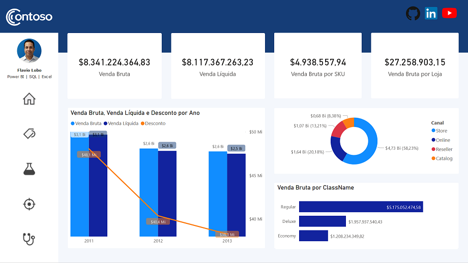
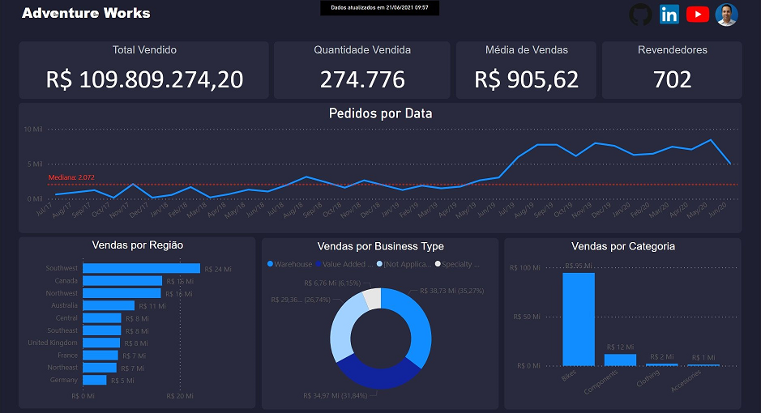
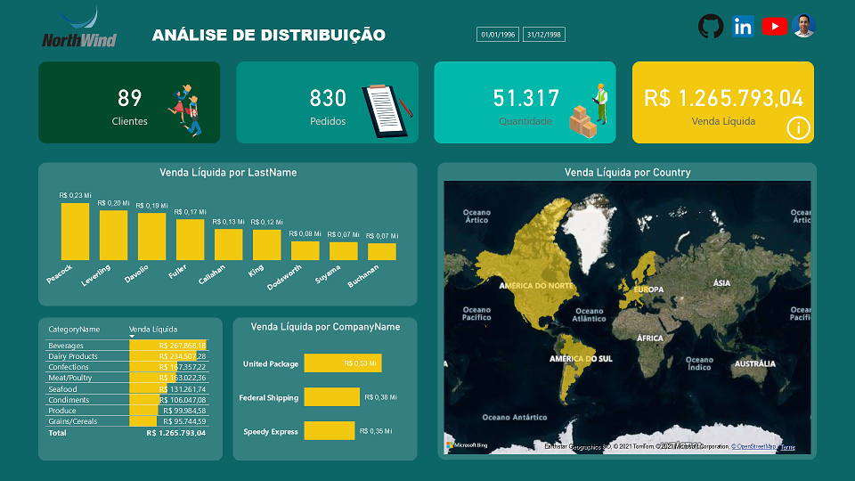

# Portifólio de [Flavio Lobo](https://www.linkedin.com/in/flavioclobo)

## Dashboards em Power BI desenvolvido por [Flavio Lobo](https://www.linkedin.com/in/flavioclobo)
Os dashboards aqui apresentados foram desenvolvidos com Microsoft Power BI utilizando dados fictícios, com bancos de dados de exemplo fornecidos gratuitamente pela Microsoft no [GitHub](https://github.com/microsoft/sql-server-samples/tree/master/samples/databases), respeitando assim a LGPD (Lei Geral de Proteção de Dados Pessoais, Lei Nº 13.709 de 14 de Agosto de 2018). O intuito desta página é demonstrar minhas habilidades em ETL (extrair, transformar e carregar), praticar a análise exploratória dos dados, criar medidas (ou métricas) relevantes com DAX, e finalmente apresentar os dados de forma atrativa e eficiente para a tomada de decisão baseada em insights através dos dados.

O Microsoft Power BI é um serviço de análise de negócios que proporciona uma visão única de seus dados corporativos, com a capacidade de monitorar a integridade dos negócios usando dashboards dinâmicos, criar relatórios interativos sofisticados e acessar dados em qualquer lugar, em seus dispositivos móveis. O Power BI permite que você projete uma variedade de relatórios atraentes e poderosos que podem ser usados para contar histórias controladas por dados e para ajudar na tomada de decisões em todos os níveis organizacionais.

### Dashboard com dados do banco de dados de exemplo Contoso.
Para abrir o dashboard em seu navegador [clique aqui.](https://app.powerbi.com/view?r=eyJrIjoiYjE2OTMwMjUtYTQyNC00M2MyLWI2ZmMtYWU3ZWM4YjA4YjY3IiwidCI6IjQ1MWU1NjVkLTZjMzMtNDU4MS05ZDUyLWE1MzUwZDY2OTU0MiJ9) Também, tenho um vídeo curto no YouTube explorando todas as páginas do relatório, [clique aqui.](https://youtu.be/lCsxmK0JwZM)

### Dashboard com dados do banco de dados de exemplo AdventureWorks.
Para abrir o dashboard em seu navegador [clique aqui](https://app.powerbi.com/view?r=eyJrIjoiMzM5MjM3MWMtOTU3NS00MmFiLTk4Y2YtOGM5MjQ5ZDliZDMyIiwidCI6IjQ1MWU1NjVkLTZjMzMtNDU4MS05ZDUyLWE1MzUwZDY2OTU0MiJ9) Também, tenho um vídeo curto no YouTube explorando todas as páginas do relatório, [clique aqui.](https://youtu.be/8KQwt4jnyk8)

### Dashboard com dados do banco de dados de exemplo NorthWind.
Para abrir o dashboard em seu navegador [clique aqui](https://app.powerbi.com/view?r=eyJrIjoiMTEyZDc0ZGQtNWE2Mi00MmU4LTg3MmQtYjYwZTk5YjAwNTlhIiwidCI6IjQ1MWU1NjVkLTZjMzMtNDU4MS05ZDUyLWE1MzUwZDY2OTU0MiJ9) Também, tenho um vídeo curto no YouTube explorando todas as páginas do relatório, [clique aqui.](https://youtu.be/uZvZppbMRIk)

