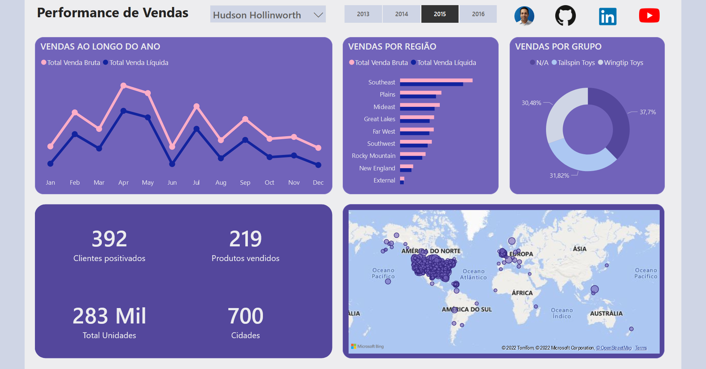

# Portifólio de [Flavio Lobo](https://www.linkedin.com/in/flavioclobo)

## Dashboards em Power BI desenvolvido por [Flavio Lobo](https://www.linkedin.com/in/flavioclobo)
Os dashboards aqui apresentados foram desenvolvidos com Microsoft Power BI utilizando dados fictícios, com bancos de dados de exemplo fornecidos gratuitamente pela Microsoft no [GitHub](https://github.com/microsoft/sql-server-samples/tree/master/samples/databases), respeitando assim a LGPD (Lei Geral de Proteção de Dados Pessoais, Lei Nº 13.709 de 14 de Agosto de 2018). O intuito desta página é demonstrar minhas habilidades em ETL (extrair, transformar e carregar), praticar a análise exploratória dos dados, criar medidas (ou métricas) relevantes com DAX, e finalmente apresentar os dados de forma atrativa e eficiente para a tomada de decisão baseada em insights através dos dados.

O Microsoft Power BI é um serviço de análise de negócios que proporciona uma visão única de seus dados corporativos, com a capacidade de monitorar a integridade dos negócios usando dashboards dinâmicos, criar relatórios interativos sofisticados e acessar dados em qualquer lugar, em seus dispositivos móveis. O Power BI permite que você projete uma variedade de relatórios atraentes e poderosos que podem ser usados para contar histórias controladas por dados e para ajudar na tomada de decisões em todos os níveis organizacionais.

### Dashboard com dados do banco de dados de exemplo Contoso.
Para abrir o dashboard em seu navegador [clique aqui.](https://app.powerbi.com/view?r=eyJrIjoiYjE2OTMwMjUtYTQyNC00M2MyLWI2ZmMtYWU3ZWM4YjA4YjY3IiwidCI6IjQ1MWU1NjVkLTZjMzMtNDU4MS05ZDUyLWE1MzUwZDY2OTU0MiJ9)

Quais são os produtos que mais receberam descontos? Estes descontos contribuíram para melhorar as vendas? Qual é o canal de vendas com o maior ticket médio? Os dados são da empresa fictícia Contoso, e o report foi desenvolvido no Microsoft Power BI, uma ótima ferramenta para realizar Business Analytics.

O produto certo, o lugar certo e a hora certa contribuem sensivelmente para impulsionar as vendas e a margem, enquanto otimizam o estoque para maximizar o desempenho. Se revisar o desempenho do varejo, analisar oportunidades, avaliar as necessidades de estoque por meio de previsões e relatórios é possível alavancar as vendas e alcançar as metas. Tenho um vídeo curto no YouTube explorando todas as páginas do relatório, [clique aqui.](https://youtu.be/lCsxmK0JwZM)

### Dashboard com dados do banco de dados de exemplo AdventureWorks.
Para abrir o dashboard em seu navegador [clique aqui](https://app.powerbi.com/view?r=eyJrIjoiMzM5MjM3MWMtOTU3NS00MmFiLTk4Y2YtOGM5MjQ5ZDliZDMyIiwidCI6IjQ1MWU1NjVkLTZjMzMtNDU4MS05ZDUyLWE1MzUwZDY2OTU0MiJ9)

Imagine que você é um gestor da distribuidora AdventureWorks, e recebe relatórios em forma de tabela, e com formatações diferentes por região. Suas análises em geral envolve verificar no report a evolução e comportamento das vendas. Você precisa tomar decisões: onde necessita mais investimento? Que tipo de campanha seria mais efetiva? Qual é o mix de produtos ideal para cada região?
 
Dentro desse contexto, agora abra o dasboard abaixo e tire suas conclusões sobre o que uma solução de businessintelligence (BI) pode entregar. O upgrade em suas análises gerenciais e em sua capacidade de tomar decisões baseado em Analytics será nítido. Tenho um vídeo curto no YouTube explorando todas as páginas do relatório, [clique aqui.](https://youtu.be/8KQwt4jnyk8)

### Dashboard com dados do banco de dados de exemplo NorthWind.
Para abrir o dashboard em seu navegador [clique aqui](https://app.powerbi.com/view?r=eyJrIjoiMTEyZDc0ZGQtNWE2Mi00MmU4LTg3MmQtYjYwZTk5YjAwNTlhIiwidCI6IjQ1MWU1NjVkLTZjMzMtNDU4MS05ZDUyLWE1MzUwZDY2OTU0MiJ9)

O relatório abaixo mostra de forma ágil e intuitiva muitas informações essenciais sobre o andamento das vendas. Isso facilita demais o controle das vendas, faturamento e os principais KPIs para facilitar a tomada de decisão e rever estratégias para obter melhores resultados em seus negócios. Com DataVisualization os gerentes têm acesso a informações que podem ajudá-los a fazer planos mais robustos e previsões precisas, ajudando-os em suas análises e a tomarem melhores decisões empresariais baseadas em dados reais e atualizados, e não apenas na experiência pessoal ou feeling.
Tenho um vídeo curto no YouTube explorando todas as páginas deste relatório, [clique aqui.](https://youtu.be/uZvZppbMRIk)

### Dashboard com dados do banco de dados de exemplo Wide World Importers.
Para abrir o dashboard em seu navegador [clique aqui](https://app.powerbi.com/view?r=eyJrIjoiYmUxNDQxNDItYTYwYy00YWE3LThlNTctNjQ1OWY3OWM0NTMxIiwidCI6IjQ1MWU1NjVkLTZjMzMtNDU4MS05ZDUyLWE1MzUwZDY2OTU0MiJ9)

Quem é o público do painel:  este painel foi criado como um relatório de nível executivo para mostrar os insights da performance de vendas de uma equipe. Como os usuários pretendidos são funcionários de nível gerencial, o painel apresenta insights de alto nível que permitem que os usuários verifiquem facilmente o desempenho de cada membro da equipe de vendas. Os usuários têm a opção adicional de mergulhar nas métricas por ano, identificando o progresso ao longo do tempo. 

Qual é a finalidade do painel:  O objetivo do painel é fornecer uma visão geral de alto nível do desempenho das vendas ao longo do tempo. Além disso, permite que os usuários mergulhem no desempenho por localização, região e grupo de clientes. Os usuários podem usar esses insights iniciais para determinar onde concentrar seus esforços. 

Quais são os principais insights do painel: Comparação entre vendas brutas e vendas líquidas, quantos clientes foram alcançados, quantos produtos diferentes foram vendidos, quantas unidades de produtos vendidos e finalmente o alcance geográfico com o número de cidades.

Tenho um vídeo curto no YouTube explorando todas as páginas deste relatório, [clique aqui.](https://youtu.be/pluAEK6HNH4)

